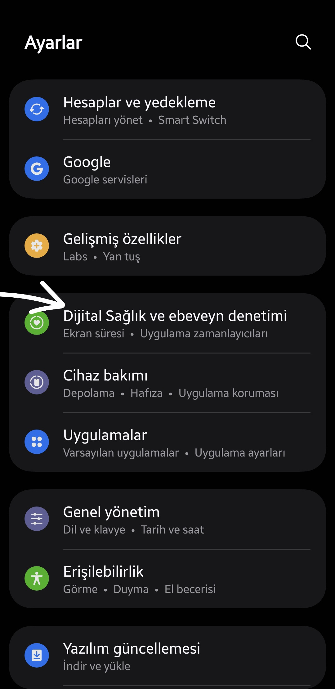

---
layout:
  width: default
  title:
    visible: true
  description:
    visible: false
  tableOfContents:
    visible: true
  outline:
    visible: true
  pagination:
    visible: true
  metadata:
    visible: true
---

# Samsung

### 📱 **Dijital Sağlık Ekranına Erişim**

Öğrencinin cihazındaki **Dijital Sağlık** ayarlarına şu adımları takip ederek ulaşabilirsiniz:

1. **Ayarlar** uygulamasını açın.
2. **Dijital Sağlık ve Ebeveyn Denetimi** sekmesini bulun ve tıklayın.
3. Buradan öğrencinin ekran süresi ve diğer kullanım alışkanlıklarını takip edebilirsiniz.

<figure><figcaption></figcaption></figure>

***

### **1. Toplam Ekran Süresi**

<figure><figcaption></figcaption></figure>

Ekranın en üst kısmında, öğrencinin gün içinde telefon ekranını aktif olarak kullandığı toplam süre görüntülenir. Bu süre, öğrencinin dijital cihazda geçirdiği zamanın genel bir özetidir. **Önceki günleri incelemek için bu alana tıklanabilir.** Böylece geçmişe ait kullanım verileri de erişilebilir.

### **2. En Çok Kullanılan Uygulamalar**

<figure><figcaption></figcaption></figure>

Kullanıcıların hangi uygulamalarda ne kadar vakit geçirdiği ayrıntılı olarak listelenir. Örneğin:

* **YouTube** – 41 dakika
* **Instagram** – 37 dakika
* **WhatsApp** – 19 dakika

Bu bilgiler sayesinde öğrencinin dikkatini en çok hangi platformlara verdiği rahatlıkla görülebilir.

### **3. Uygulama Kategorileri**

<figure><figcaption></figcaption></figure>

Kullanım süresi, uygulama türlerine göre kategorilere ayrılmıştır. Örneğin:

* **Sosyal** – 1 saat 8 dakika
* **Video** – 41 dakika
* **Alışveriş ve Yemek** – 20 dakika
* **Görüntü** – 19 dakika

Bu sayede yalnızca bireysel uygulamalar değil, kullanım alışkanlıkları da bütünsel olarak değerlendirilebilir.

### **4. Ekran Süresi Hedefi Belirleme**

<figure><figcaption></figcaption></figure>

Veliler, öğrencinin ekran süresini yönetebilmek adına günlük ekran süresi hedefi belirleyebilir.

### **5. Uygulama Zamanlayıcıları**

<figure><figcaption></figcaption></figure>

Instagram gibi belirli uygulamalar veya sosyal medya gibi belirli kategoriler için günlük kullanım süresi sınırı ayarlanabilir.

### **6. İçerik Kısıtlamaları**

<figure><figcaption></figcaption></figure>

Samsung Internet ve Galaxy Store üzerinden çocuklara uygun içerik filtreleri ve satın alma kısıtlamaları uygulanabilir.

### **7. Ebeveyn Denetimi**

<figure><figcaption></figcaption></figure>

Ebeveyn denetimi altında kullanım süresi ve uygulama erişimi gibi konularda detaylı kontrol sağlanabilir.



### &#x38;**. Odak ve Uyku Modları**

<figure><figcaption></figcaption></figure>

Gerektiğinde öğrencinin ders çalıştığı veya uyuduğu zamanlarda telefonun dikkat dağıtıcı unsurları devre dışı bırakılabilir. Bu modlar, cihazı belirlenen saatlerde otomatik olarak sınırlandırır.
