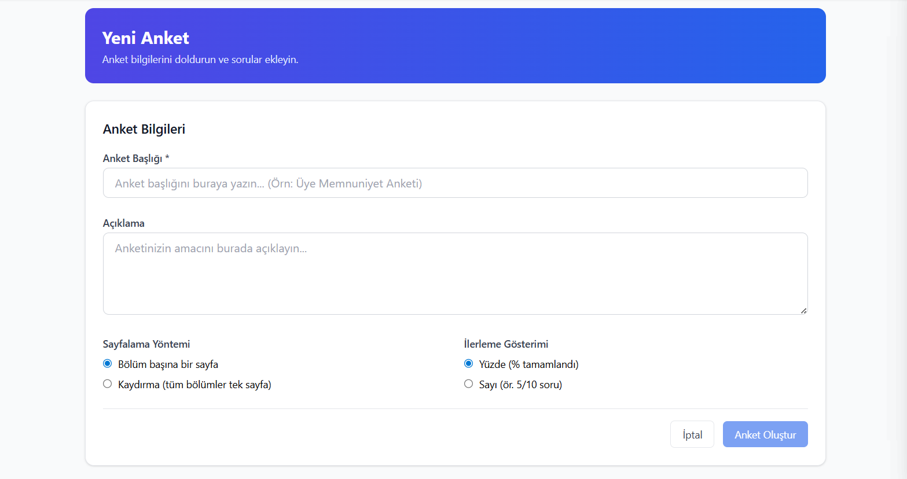

# Anket Nasıl Oluşturulur?

* Sol kısımda bulunan **Anketler** bölümüne tıklayın.

<figure><figcaption></figcaption></figure>

***

* **Yeni Anket Oluştur** butonuna basın.
  * Anket adı girin.
  * Açıklama ekleyin.
  * Sayfalama yönetimini seçin.
* Ardından **Anket Oluştur** butonuna tıklayın.

<figure><figcaption></figcaption></figure>

* Açılan ekranda alt kısımda bulunan:
  * **Bölüm Ekle** kısmını kullanarak anket bölümleri ekleyin.
  * **Yeni Soru** kısmını kullanarak sorularınızı ekleyin.
* En alt kısımda bulunan **Katılımcı Ekle** bölümünden ankete katılacak kişi veya sınıfları seçin.
  * Son olarak **Güncelle** butonuna basın.

***
