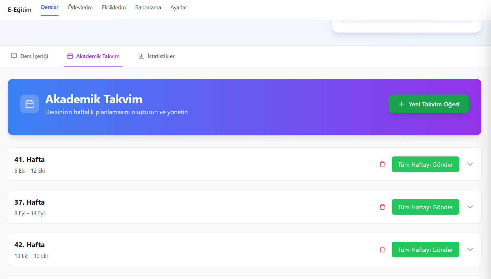

---
layout:
  width: default
  title:
    visible: true
  description:
    visible: false
  tableOfContents:
    visible: true
  outline:
    visible: true
  pagination:
    visible: true
  metadata:
    visible: true
---

# Akademik Takvim Nasıl Kullanılır?

### 1. E-Eğitim Modülünü Açın

Sol tarafta bulunan **E-Eğitim** modülünü seçin.

<figure><figcaption></figcaption></figure>

***

### 2. Dersi Seçin

Kendi dersinize tıklayarak ders sayfanızı açın.

<figure><figcaption></figcaption></figure>

***

### 3. Akademik Takvim Alanına Gidin

Sayfanın orta kısmında bulunan **Akademik Takvim** seçeneğine basın.

<figure><figcaption></figcaption></figure>

***

### 4. Yeni Takvim Öğesi Ekleyin

* “Yeni Takvim Öğesi” butonuna tıklayın.
* Açılan ekrandan şu seçimleri yapabilirsiniz:
  * Hafta Seçimi
  * Sınıf / Departman Seçimi
  * Video, Test, PDF veya Diğer İçerikler

***

### 5. Eklediğiniz Ödevleri Görüntüleme

Eklediğiniz ödevler takvimde listelenecektir.

***

### 6. Ödevleri Gönderme

* Eğer o haftadaki tüm ödevleri göndermek istiyorsanız **“Tüm Haftayı Gönder”** seçeneğini kullanın.
*   Sadece belirli ödevleri göndermek için:

    * Sağdaki aşağı ok butonuna basın.
    * Açılan seçeneklerden **Gönder** butonuna tıklayın.

