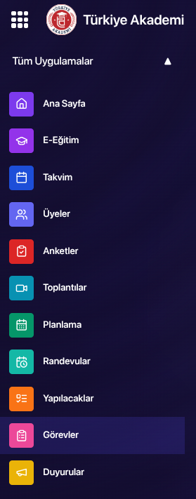

---
layout:
  width: default
  title:
    visible: true
  description:
    visible: false
  tableOfContents:
    visible: true
  outline:
    visible: true
  pagination:
    visible: true
  metadata:
    visible: true
---

# Video İçeriklerine Kazanım Nasıl Eklenir?

### 1. E-Eğitim Modülünü Açın

* Sol tarafta yer alan **mor modüller ekranından** **E-Eğitim** modülünü seçin.
* Karşınıza sorumlu olduğunuz derslerin listelendiği bir ekran gelecektir.

<figure><figcaption></figcaption></figure>

***

### 2. Dersi Seçin

* Kazanım eklemek istediğiniz dersi seçin.
* Ardından **“Derse Git”** butonuna tıklayın.
* Açılan ekranda, dersinize dair tüm bilgilere kolayca erişebilirsiniz.

<figure><figcaption></figcaption></figure>

***

### 3. Ders İçeriği Alanına Gidin

* Sayfayı aşağıya kaydırın ve **Ders İçeriği** başlığını bulun.
* Burada dersinizdeki mevcut bölümler listelenir.

<figure><figcaption></figcaption></figure>

***

### 4. Bölüm İçeriklerini Görüntüleme

* Mevcut bölümlerin içeriklerini görmek için bölüm başlığının solundaki **ok tuşuna** tıklayın.

<figure><figcaption></figcaption></figure>

***

### 5. Kazanım Ekle Butonuna Tıklayın

* Video içeriklerinin sağ tarafında bulunan **yeşil “Kazanım Ekle”** butonuna tıklayın.

<figure><figcaption></figcaption></figure>

***

### 6. Kazanım Bilgilerini Girin

* Açılan ekranda **Kazanım Açıklaması** kısmına, videoya eklenecek kazanımı yazın.
* **Başlangıç Zamanı**: Kazanımın videonun kaçıncı dakikasında ve saniyesinde başladığını belirtin.
* **Bitiş Zamanı**: Kazanımın videonun kaçıncı dakikasında ve saniyesinde bittiğini belirtin.

<figure><figcaption></figcaption></figure>

***

### 7. Kazanımı Kaydedin

* Tüm bilgileri doldurduktan sonra **Kaydet** butonuna basın.
* Artık video içeriğinizde ilgili kazanım başarıyla tanımlanmış olacaktır.
