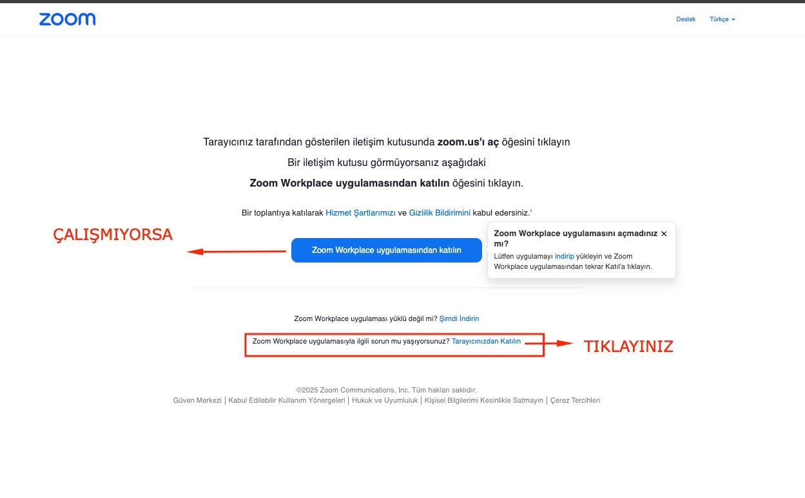

---
layout:
  width: default
  title:
    visible: true
  description:
    visible: false
  tableOfContents:
    visible: true
  outline:
    visible: true
  pagination:
    visible: true
  metadata:
    visible: true
---

# Toplantılara Neden Katılamıyorum? (iOS)

Eğer iOS cihazınızda toplantılara katılmakta sorun yaşıyorsanız, Safari ayarlarında **Pencereleri Engelle** seçeneğinin açık olması bu soruna sebep olabilir. Bu ayarı kapatarak problemi çözebilirsiniz.

***

### Adımlar:

* **Ayarlar** uygulamasını açın.
* Aşağıya kaydırın ve **Uygulamalar** bölümüne dokunun.
* Listeden **Safari**yi seçin.
* Sayfayı kaydırarak **Genel** bölümünü bulun.
* Burada yer alan **Pencereleri Engelle** seçeneğinin **kapalı** olduğundan emin olun.

Bu adımları uyguladıktan sonra toplantılara sorunsuz şekilde katılabilirsiniz.

***


“Pencereleri Engelle” seçeneği açık kalırsa toplantılar açılmayabilir. Bu yüzden ayarın kapalı olduğundan emin olun.


<figure><figcaption></figcaption></figure>

