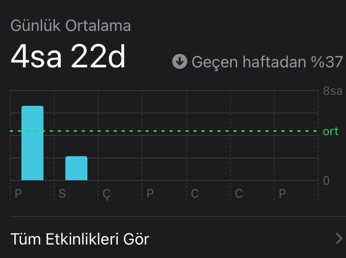
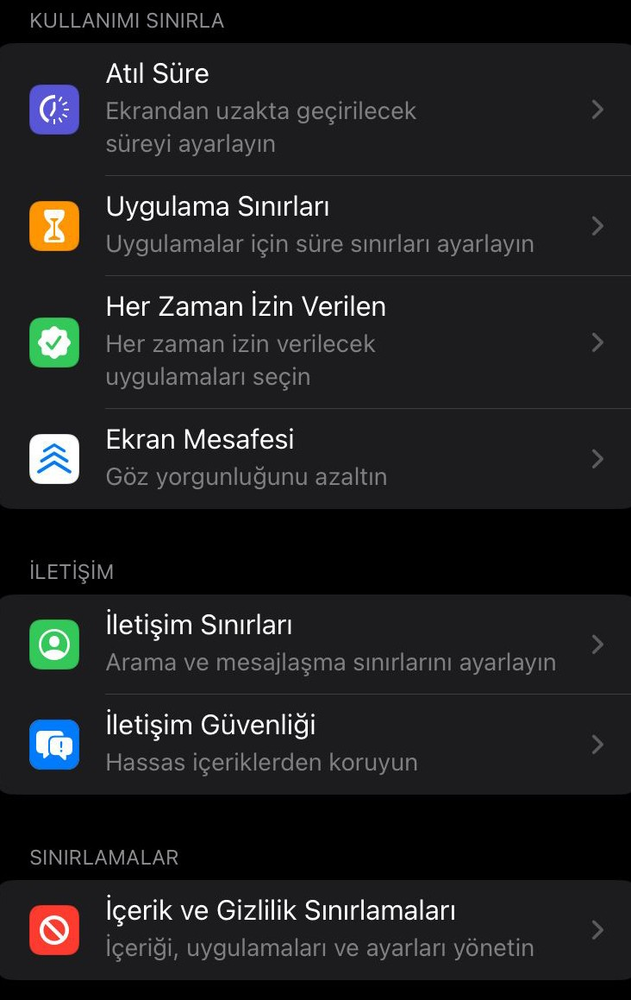

---
layout:
  width: default
  title:
    visible: true
  description:
    visible: false
  tableOfContents:
    visible: true
  outline:
    visible: true
  pagination:
    visible: true
  metadata:
    visible: true
---

# iPhone

### 1. Nereden Ulaşılır?

* Ana ekrandan **Ayarlar** uygulamasını aç.
* Aşağıya kaydır ve **Ekran Süresi** bölümüne dokun.
* Buradan günlük kullanım süresi, en çok kullanılan uygulamalar ve alınan bildirim sayısı görülebilir.

<figure><figcaption></figcaption></figure>

***

### 2. Kullanılabilecek Özellikler

#### 🕒 Günlük Ortalama ve Kullanım Grafiği

Gün içinde ekranda ne kadar vakit geçirildiği gösterilir. Hangi gün, hangi uygulama ne kadar kullanıldı gibi detaylar yer alır.

**Nasıl bakılır:** “Ekran Süresi” menüsünden “Tüm Etkinlikleri Gör” seçeneğine dokun. Günlük ve haftalık raporlar incelenebilir.

<figure><figcaption></figcaption></figure>

***

#### ⏳ Atıl Süre

Belirli saatlerde tüm uygulamaları otomatik olarak sınırlar. Sadece izin verilen uygulamalar açık kalır.

**Nasıl ayarlanır:** “Atıl Süre” yazısına dokun. Başlama ve bitiş saatini gir. Örneğin uyku saatine denk gelecek şekilde düzenlenebilir.

***

#### 📱 Uygulama Sınırları

Belirli uygulamalara günlük kullanım süresi konur. Süre dolunca uygulama kullanılamaz.

**Nasıl ayarlanır:** “Uygulama Sınırları”na gir. Uygulama veya kategori seçilir, günlük süre belirlenir.

***

#### ✅ Her Zaman İzin Verilen

Atıl süre veya uygulama sınırından etkilenmeyecek uygulamaları seçmek için kullanılır. Örneğin, arama veya mesaj uygulaması bu bölüme eklenebilir.

**Nasıl ayarlanır:** “Her Zaman İzin Verilen” bölümünden uygulama seçimi yapılır. Dilerseniz sadece belirli kişilerle iletişim izni verebilirsin.

***

#### 👁️‍🗨️ Ekran Mesafesi

Telefon çok yakından tutulduğunda uyarı verir. Çocuğun ekranı göz sağlığına uygun mesafede kullanmasını sağlar.

**Nasıl çalışır:** Bu özellik açıkken cihaz 30 cm’den yakın tutulursa “Uzaklaştırın” uyarısı çıkar ve ekran geçici olarak durur.

***

#### 📞 İletişim Sınırları

Çocuğun kimlerle mesajlaşabileceğini ve arama yapabileceğini sınırlamak için kullanılır.

**Nasıl ayarlanır:** “İletişim Sınırları” bölümüne gir. İzin verilen kişiler seçilir. Atıl sürede de geçerli olabilir.

***

#### 🛡️ İletişim Güvenliği

Uygunsuz fotoğraf veya video içeriklerine karşı koruma sağlar. Cihaz, çocuklara uygun olmayan görselleri tespit edip uyarı verir.

**Not:** Tüm işlemler cihaz üzerinde gerçekleşir. Apple bu içeriklere erişmez.

***

#### 🚫 İçerik ve Gizlilik Sınırlamaları

Uygunsuz uygulamalar, web siteleri ve içerikler bu bölümden engellenebilir. Uygulama yükleme veya ayar değiştirme işlemleri sınırlandırılabilir.

**Nasıl ayarlanır:** “İçerik ve Gizlilik Sınırlamaları”na gir. Web, uygulama ve gizlilik filtrelerini düzenle.

***

#### 🔐 Ekran Süresi Ayarlarını Kilitle

Yapılan ayarların çocuğunuz tarafından değiştirilmesini önler. Dört haneli bir parola girilerek koruma sağlanır.

**Nasıl ayarlanır:** Sayfanın en altındaki “Ekran Süresi Ayarlarını Kilitle” seçeneğine dokun. Parola belirle.

***

#### 🔄 Tüm Aygıtlarla Paylaş

Aynı Apple hesabına bağlı tüm cihazlardaki ekran süresi bilgilerini birleştirir. iPad, iPhone gibi cihazların toplam kullanımı birlikte görünür.

**Nasıl etkinleştirilir:** Sayfanın altındaki “Tüm Aygıtlarla Paylaş” seçeneğini aktif hale getir.
