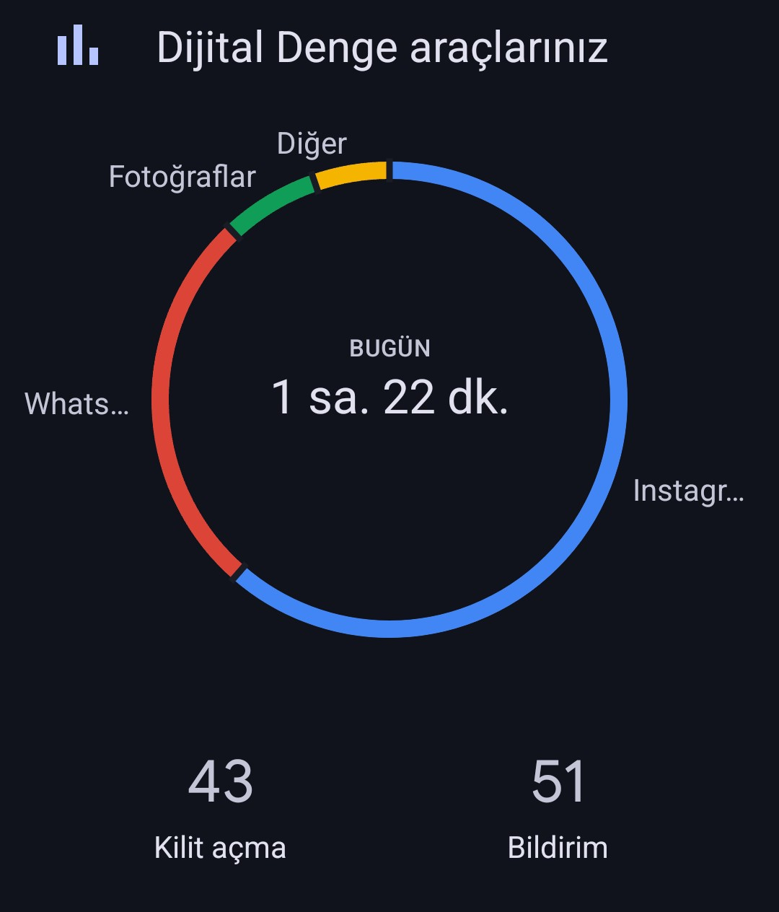
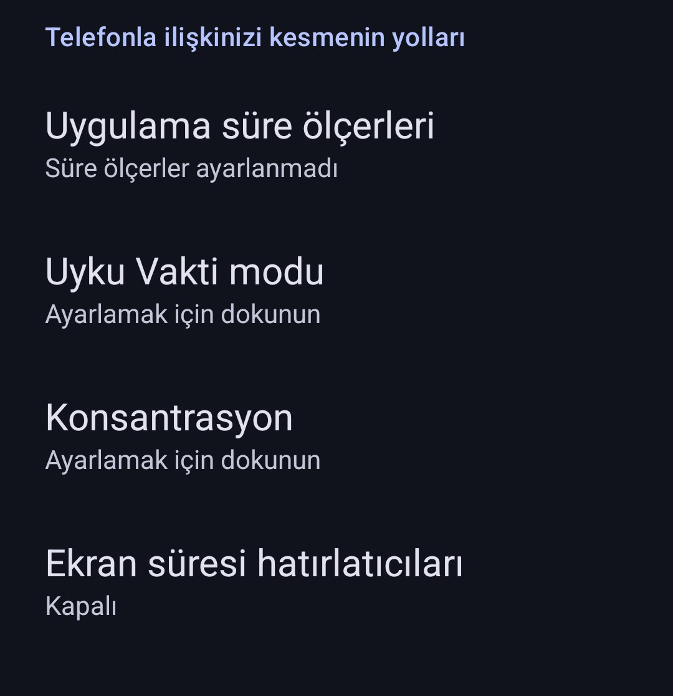
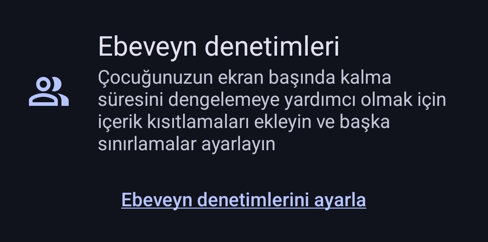

---
layout:
  width: default
  title:
    visible: true
  description:
    visible: false
  tableOfContents:
    visible: true
  outline:
    visible: true
  pagination:
    visible: true
  metadata:
    visible: true
---

# Realme

### 1. Nereden Ulaşılır?

* Ana ekrandan **Ayarlar** uygulamasını aç.
* Aşağıya kaydır ve **Dijital Denge ve ebeveyn denetimleri** bölümünü bul.
* Burada gün içinde telefonda ne kadar vakit geçirildiği, hangi uygulamaların kullanıldığı ve kaç bildirim alındığı görülür.

<figure><figcaption></figcaption></figure>

***

### 2. Kullanılabilecek Özellikler

#### 🕒 Uygulama Süre Ölçerleri

Belirli uygulamalara günlük kullanım sınırı koymak için kullanılır. Örneğin, Instagram’a 1 saat sınır konulursa, süre dolunca o gün için uygulama kullanılamaz.

**Nasıl ayarlanır:** “Uygulama süre ölçerleri” yazısına dokun. Açılan listeden uygulama seçilir ve süre belirlenir.

<figure><figcaption></figcaption></figure>

***

#### 🌙 Uyku Vakti Modu

Belirli bir saatten sonra ekran siyah-beyaz olur, bildirimler sessize alınır. Bu özellik, çocuğun uyku saatine odaklanmasına yardımcı olur.

**Nasıl ayarlanır:** “Uyku Vakti modu”na dokun. Başlama ve bitiş saatini gir. İsteğe göre ekranı gri yapabilir ve rahatsız etme modunu etkinleştirebilirsin.

***

#### 🎯 Konsantrasyon

Belirli uygulamaları geçici olarak devre dışı bırakır. Örneğin, ders çalışma süresince sosyal medya uygulamaları kullanılamaz.

**Nasıl ayarlanır:** “Konsantrasyon” yazısına dokun. Hangi uygulamaların engelleneceğini seç ve süreyi belirle.

***

#### 🔔 Ekran Süresi Hatırlatıcıları

Gün içinde belirli bir süre aşıldığında kullanıcıyı uyarır. Örneğin, 2 saati geçince ekranda bir hatırlatma çıkar.

**Nasıl ayarlanır:** “Ekran süresi hatırlatıcıları”na dokun ve günlük sınır gir.

***

### 3. Ebeveyn Denetimleri (Sayfanın En Altında Yer Alır)

Sayfanın en altına indiğinde **“Ebeveyn denetimlerini ayarla”** şeklinde mavi bir yazı görürsün. Bu özellik, çocuğun cihaz kullanımını daha ayrıntılı şekilde yönetmek isteyen veliler içindir.

**Aşamalar şunlardır:**

* Açıklama ekranı gelir, burada ekran süresi ve içerik kısıtlaması gibi kontrollerden bahsedilir.
* Devam tuşuna basıldığında cihazın “ebeveyn telefonu mu, çocuğun telefonu mu” olduğu sorulur.
  * Bu cihaz çocuğun telefonuyorsa, **çocuğun cihazı** olarak seçilmelidir.
* Ardından Google’ın sunduğu ek kontrol uygulamasını indirmeniz istenir. Bu sayede içerik filtresi, uzaktan kontrol gibi işlemler yapılabilir.

Bu adımlar ileri seviye kullanım için uygundur. Eğer yalnızca telefonun kendi içindeki özellikler yeterliyse yukarıda anlatılan süre sınırlamaları ve odak modları tek başına kullanılabilir.

<figure><figcaption></figcaption></figure>
